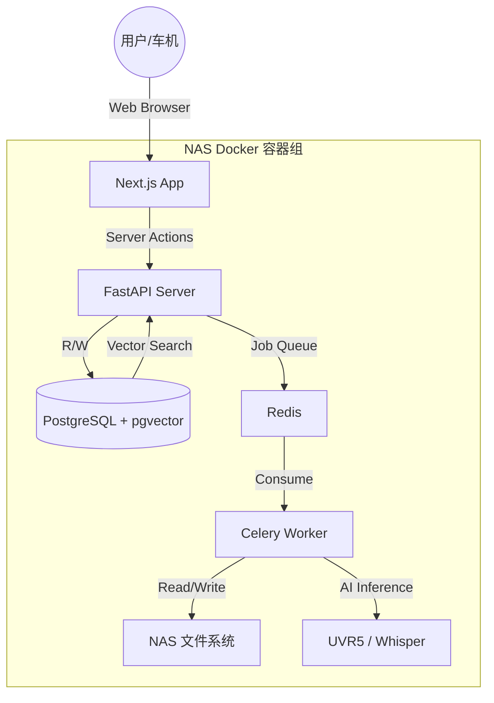

# Nebula KTV - 技术设计文档

## Overview

Nebula KTV 是一套 AI 驱动的私有化车载 KTV 系统，采用微服务化容器架构部署在家用 NAS 上，通过 Web 播放器在极氪车机浏览器上提供沉浸式 K 歌体验。

**核心设计原则：**
- **AI-First Architecture**: 数据层预埋向量存储，逻辑层采用 LangGraph 图编排思想
- **MVP-First Implementation**: 优先跑通核心闭环，预留扩展接口
- **Car-First UX**: 大触控区、极简层级、防误触设计

**技术栈：**
- 前端: Next.js 14 (App Router) + Tailwind CSS + shadcn/ui
- 后端: FastAPI (Python 3.11+) + Celery + Redis
- 数据库: PostgreSQL 16 + pgvector
- AI 模型: UVR5 (音频分离) + faster-whisper (语音识别)

## Architecture



**架构分层：**

1. **表现层 (Presentation Layer)**
   - Next.js RSC 将计算压力留在服务端
   - Tailwind + shadcn/ui 实现暗夜玻璃质感 UI
   - Web Audio API 处理音频切换和混响

2. **业务层 (Business Layer)**
   - FastAPI 提供 REST API 和媒体流服务
   - Celery 异步处理 AI 任务队列
   - LangGraph 编排处理流程节点

3. **数据层 (Data Layer)**
   - PostgreSQL 统一管理结构化数据
   - pgvector 存储 AI 特征向量
   - JSONB 存储扩展元数据

## Components and Interfaces

### 1. Frontend Components

```
frontend/
├── app/
│   ├── page.tsx              # 首页资源库
│   ├── player/[id]/page.tsx  # 播放器页面
│   └── api/                   # API Routes
├── components/
│   ├── library/
│   │   ├── SearchBar.tsx     # 全局搜索框
│   │   ├── RecentSection.tsx # 最近添加区域
│   │   └── SongList.tsx      # 歌曲列表
│   ├── player/
│   │   ├── VideoPlayer.tsx   # 视频播放器
│   │   ├── AudioManager.tsx  # 音频管理器 (三轨同步)
│   │   ├── LyricsDisplay.tsx # 歌词显示
│   │   ├── ImmersiveMode.tsx # 沉浸模式
│   │   └── ControlBar.tsx    # 交互控制栏
│   └── ui/                    # shadcn/ui 组件
└── lib/
    ├── audio/
    │   └── crossfade.ts      # Crossfade 音频切换
    └── api/
        └── client.ts         # API 客户端
```

#### SearchBar Component
```typescript
interface SearchBarProps {
  onSearch: (query: string) => void;
  placeholder?: string;
}
```

#### AudioManager Component
```typescript
interface AudioManagerProps {
  videoSrc: string;
  originalSrc: string;
  instrumentalSrc: string;
  onReady: () => void;
  onError: (error: AudioError) => void;
}

interface AudioManagerState {
  isReady: boolean;
  isPlaying: boolean;
  currentTime: number;
  duration: number;
  vocalMode: 'original' | 'instrumental';
  isBuffering: boolean;
}
```

#### Crossfade Utility
```typescript
interface CrossfadeOptions {
  duration: number; // 默认 500ms
  fromGain: GainNode;
  toGain: GainNode;
}

function crossfade(options: CrossfadeOptions): Promise<void>;
```

### 2. Backend Components

```
backend/
├── app/
│   ├── main.py               # FastAPI 入口
│   ├── api/
│   │   ├── songs.py          # 歌曲 CRUD API
│   │   └── stream.py         # 媒体流 API
│   ├── models/
│   │   ├── song.py           # Song 数据模型
│   │   └── media_asset.py    # MediaAsset 数据模型
│   ├── services/
│   │   ├── song_service.py   # 歌曲业务逻辑
│   │   └── search_service.py # 搜索服务
│   └── db/
│       └── database.py       # 数据库连接
├── worker/
│   ├── celery_app.py         # Celery 配置
│   └── tasks/
│       ├── process_song.py   # 歌曲处理任务
│       ├── separate_audio.py # UVR5 音频分离
│       └── transcribe.py     # Whisper 歌词生成
└── tests/
```

#### REST API Endpoints

| Method | Endpoint | Description |
|--------|----------|-------------|
| GET | `/api/songs` | 获取歌曲列表 (支持分页、搜索) |
| GET | `/api/songs/{id}` | 获取单首歌曲详情 |
| POST | `/api/songs` | 创建歌曲记录 |
| PATCH | `/api/songs/{id}` | 更新歌曲信息 |
| DELETE | `/api/songs/{id}` | 删除歌曲 |
| GET | `/api/songs/recent` | 获取最近添加的歌曲 |
| GET | `/api/songs/search` | 搜索歌曲 |
| GET | `/api/stream/{asset_id}` | 媒体流 (支持 Range) |

#### Song Service Interface
```python
class SongService:
    async def create_song(self, data: SongCreate) -> Song
    async def get_song(self, song_id: UUID) -> Song | None
    async def list_songs(self, skip: int, limit: int, query: str | None) -> list[Song]
    async def update_song(self, song_id: UUID, data: SongUpdate) -> Song
    async def delete_song(self, song_id: UUID) -> bool
    async def get_recent_songs(self, limit: int) -> list[Song]
    async def search_songs(self, query: str) -> list[Song]
```

#### Celery Task Interface
```python
@celery_app.task
def process_song_task(song_id: str, file_path: str) -> dict:
    """
    完整的歌曲处理流水线:
    1. 提取音频
    2. UVR5 分离人声/伴奏
    3. Whisper 生成歌词
    4. 更新数据库状态
    """
    pass
```

## Data Models

### Song Model
```python
class Song(BaseModel):
    id: UUID
    title: str
    artist: str
    status: SongStatus  # PENDING, PROCESSING, READY, PARTIAL, FAILED
    title_abbr: str | None  # 拼音首字母
    artist_abbr: str | None
    region: str | None
    meta_json: dict  # 扩展元数据 (BPM, Key, Tags 等)
    feature_vector: list[float] | None  # 768维向量
    created_at: datetime
    updated_at: datetime

class SongStatus(str, Enum):
    PENDING = "PENDING"
    PROCESSING = "PROCESSING"
    READY = "READY"
    PARTIAL = "PARTIAL"
    FAILED = "FAILED"
```

### MediaAsset Model
```python
class MediaAsset(BaseModel):
    id: UUID
    song_id: UUID
    type: AssetType  # video_main, audio_original, audio_inst, lyrics_json
    path: str
    file_meta: dict  # bitrate, codec, size

class AssetType(str, Enum):
    VIDEO_MAIN = "video_main"
    AUDIO_ORIGINAL = "audio_original"
    AUDIO_INST = "audio_inst"
    LYRICS_JSON = "lyrics_json"
```

### Database Schema
```sql
-- 启用 AI 向量扩展
CREATE EXTENSION IF NOT EXISTS vector;

-- 歌曲主表
CREATE TABLE songs (
    id UUID PRIMARY KEY DEFAULT gen_random_uuid(),
    title TEXT NOT NULL,
    artist TEXT NOT NULL,
    status VARCHAR(20) DEFAULT 'PENDING',
    title_abbr VARCHAR(50),
    artist_abbr VARCHAR(50),
    region VARCHAR(20),
    meta_json JSONB DEFAULT '{}',
    feature_vector vector(768),
    created_at TIMESTAMPTZ DEFAULT NOW(),
    updated_at TIMESTAMPTZ DEFAULT NOW()
);

-- 媒体资产表
CREATE TABLE media_assets (
    id UUID PRIMARY KEY DEFAULT gen_random_uuid(),
    song_id UUID REFERENCES songs(id) ON DELETE CASCADE,
    type VARCHAR(30) NOT NULL,
    path TEXT NOT NULL,
    file_meta JSONB DEFAULT '{}'
);

-- 索引
CREATE INDEX ON songs USING hnsw (feature_vector vector_cosine_ops);
CREATE INDEX idx_songs_meta ON songs USING GIN (meta_json);
CREATE INDEX idx_songs_title_abbr ON songs (title_abbr);
CREATE INDEX idx_songs_artist_abbr ON songs (artist_abbr);
```


## Correctness Properties

*A property is a characteristic or behavior that should hold true across all valid executions of a system-essentially, a formal statement about what the system should do. Properties serve as the bridge between human-readable specifications and machine-verifiable correctness guarantees.*

基于需求分析，以下是系统必须满足的正确性属性：

### Property 1: 歌曲数据持久化 Round-Trip

*For any* 有效的歌曲数据，创建歌曲后查询应返回等价的数据对象。

**Validates: Requirements 8.1**

### Property 2: 拼音首字母生成一致性

*For any* 中文字符串，拼音首字母转换函数应返回仅包含小写字母的字符串，且长度等于输入字符串的字符数。

**Validates: Requirements 1.2**

### Property 3: 歌曲状态枚举约束

*For any* 歌曲状态更新操作，状态值必须是 PENDING、PROCESSING、READY、PARTIAL 或 FAILED 之一。

**Validates: Requirements 1.4**

### Property 4: 搜索结果相关性

*For any* 搜索查询和歌曲数据集，返回的所有结果必须在标题或歌手名中包含查询字符串（或其拼音首字母匹配）。

**Validates: Requirements 3.2**

### Property 5: 处理中歌曲不可播放

*For any* 状态为 PROCESSING 的歌曲，尝试播放应返回错误或阻止操作。

**Validates: Requirements 3.5**

### Property 6: 三轨同步播放约束

*For any* 播放状态，当任一媒体源处于缓冲状态时，所有轨道必须暂停。

**Validates: Requirements 6.2, 6.3**

### Property 7: Crossfade 增益值约束

*For any* Crossfade 操作，在任意时刻两个音轨的增益值之和应接近 1.0（允许 ±0.1 误差）。

**Validates: Requirements 6.4**

### Property 8: HTTP Range 响应正确性

*For any* 带有 Range 头的媒体请求，响应必须包含正确的 Content-Range 头，且返回的字节范围与请求匹配。

**Validates: Requirements 9.1, 9.2**

### Property 9: 媒体资产记录完整性

*For any* 处理完成的歌曲，media_assets 表中必须存在对应的 video_main、audio_original、audio_inst 记录。

**Validates: Requirements 8.2**

### Property 10: JSONB 查询正确性

*For any* JSONB 筛选条件，返回的歌曲必须满足该条件。

**Validates: Requirements 8.3**

### Property 11: 错误状态记录完整性

*For any* 处理失败的歌曲，状态必须为 FAILED 且 meta_json 中包含 error 字段。

**Validates: Requirements 2.5**

## Error Handling

### 1. AI 处理错误

| 错误场景 | 处理策略 | 用户反馈 |
|---------|---------|---------|
| UVR5 分离失败 | 标记状态为 FAILED，记录错误日志 | 歌曲卡片显示"处理失败" |
| Whisper 转写失败 | 标记状态为 PARTIAL，允许无歌词播放 | 播放时不显示歌词 |
| 文件格式不支持 | 拒绝处理，记录错误 | Toast 提示"不支持的文件格式" |

### 2. 播放错误

| 错误场景 | 处理策略 | 用户反馈 |
|---------|---------|---------|
| 视频加载失败 | 阻止播放，显示错误 | 全屏错误提示 |
| 伴奏加载失败 | 降级为仅原唱模式 | 禁用切换开关，顶部提示 |
| 原唱加载失败 | 降级为仅伴奏模式 | 禁用切换开关，顶部提示 |
| 网络中断 | 暂停播放，等待恢复 | Loading 动画 |

### 3. 数据库错误

| 错误场景 | 处理策略 | 用户反馈 |
|---------|---------|---------|
| 连接失败 | 重试 3 次，间隔指数退避 | 首页显示"连接中..." |
| 查询超时 | 返回缓存数据或空列表 | 显示"加载失败，请重试" |
| 写入失败 | 事务回滚，记录日志 | Toast 提示操作失败 |

## Testing Strategy

### 测试框架选择

- **后端单元测试**: pytest + pytest-asyncio
- **后端属性测试**: hypothesis (Python PBT 库)
- **前端单元测试**: Vitest + React Testing Library
- **前端属性测试**: fast-check (TypeScript PBT 库)
- **E2E 测试**: Playwright

### 属性测试配置

每个属性测试配置运行 **100 次迭代**，确保覆盖足够的输入空间。

```python
# pytest + hypothesis 配置示例
from hypothesis import settings

@settings(max_examples=100)
@given(...)
def test_property_xxx():
    pass
```

```typescript
// fast-check 配置示例
fc.assert(
  fc.property(..., (input) => {
    // property assertion
  }),
  { numRuns: 100 }
);
```

### 测试分层

1. **单元测试**
   - 拼音转换函数
   - Crossfade 增益计算
   - 状态机转换逻辑
   - API 响应格式验证

2. **属性测试**
   - 数据持久化 round-trip (Property 1)
   - 拼音生成一致性 (Property 2)
   - 搜索结果相关性 (Property 4)
   - Crossfade 增益约束 (Property 7)
   - HTTP Range 响应 (Property 8)

3. **集成测试**
   - API 端到端流程
   - 数据库 CRUD 操作
   - Celery 任务执行

4. **E2E 测试**
   - 首页加载和搜索
   - 播放器模式切换
   - 原唱/伴奏切换

### 测试标注格式

所有属性测试必须使用以下格式标注：

```
**Feature: nebula-ktv, Property {number}: {property_text}**
```

示例：
```python
# **Feature: nebula-ktv, Property 1: 歌曲数据持久化 Round-Trip**
@given(song_data=song_strategy())
def test_song_persistence_roundtrip(song_data):
    ...
```
